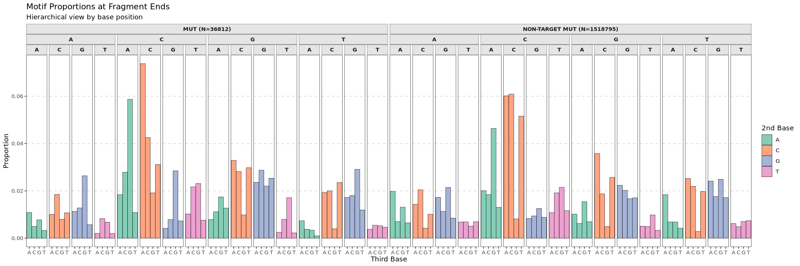
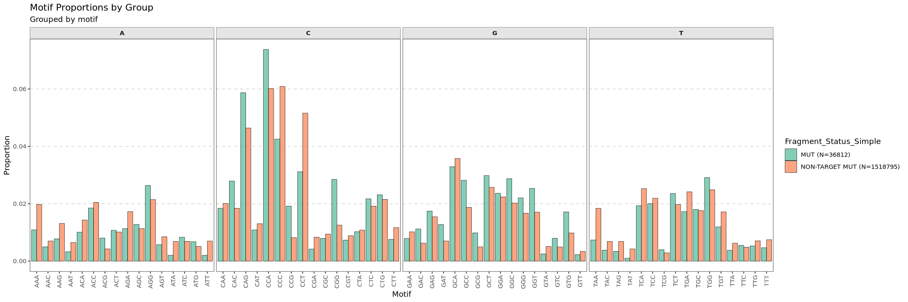

# fRagmentomics 


[](https://codecov.io/gh/ElsaB-Lab/fRagmentomics)

## Overview

Plasma circulating cell-free DNA (cfDNA) analysis has transformed cancer care. However, the majority of cfDNA originates from hematopoietic cells (see [Mattox et al. Cancer Discov. 2023](https://aacrjournals.org/cancerdiscovery/article/13/10/2166/729365/The-Origin-of-Highly-Elevated-Cell-Free-DNA-in) and references therein), which complicates the interpretation of circulating tumor DNA (ctDNA) in the absence of matched sequencing tumor-free blood cells (e.g white blood cells). Multiple studies in the past have demonstrated that ctDNA fragments have distinct size distribution profiles and 5’/3’ end sequences compared to healthy cfDNA fragments (see [Snyder et al. Cancer Cell. 2016](https://pubmed.ncbi.nlm.nih.gov/26771485/), [Mouliere et al. Sci Trans Med. 2018](https://pubmed.ncbi.nlm.nih.gov/30404863/), [Cristiano et al. Nature. 2019](https://pubmed.ncbi.nlm.nih.gov/31142840/))

With the growing interest in the characteristics of cfDNA fragments ("fragmentomics"), some tools have been published to analyse fragmentomic features ([Wang et al. Genome Biol. 2025](https://genomebiology.biomedcentral.com/articles/10.1186/s13059-025-03607-5)). However, the challenge that fRagmentomics addresses is to characterize each cfDNA fragment by its fragmentomic features (fragment length, 5′/3′ end motifs, inner distance, aligned position, etc.) and its mutational status, whether a single-nucleotide variant (SNV), a multi-nucleotide variant (MNV), an insertion or a deletion (indel). Indeed, indels play a key role in precision oncology, whereby for example deletions in exon 19 of the epidermal growth factor receptor (EGFR) gene identify patients with non-small-cell lung cancer who respond to gefitinib ([Lynch et al. N Engl J Med. 2004](https://www.nejm.org/doi/full/10.1056/NEJMoa040938)). The main reason for this is that the genotyping of each individual fragment using predefined mutations is quite challenging for indels due to the multiple alignment representations ([Tan et al. Bioinformatics. 2015](https://academic.oup.com/bioinformatics/article/31/13/2202/196142?login=true)) and because short reads may only partially cover indel contexts, especially in repetitive sequence, leading to ambiguous evidence. ([Narzisi et al. Frontiers. 2015](https://www.frontiersin.org/journals/bioengineering-and-biotechnology/articles/10.3389/fbioe.2015.00008/full)). Additionally, the calculation of the exact fragment size is in practice more involved than a simple difference between the aligned positions of the fragment boundaries ([official SAM/BAM file format documentation](https://samtools.github.io/hts-specs/SAMv1.pdf)).

**fRagmentomics** provides a standardized and user-friendly R package that reports fragment features (size, end motifs, position) and mutational status using a BAM file with sequenced fragments and a user-defined list of SNV, MNV, or indel mutations. By providing a framework allowing a per-fragment analysis, fRagmentomics aims to support the interpretation of liquid biopsy results and the discovery of new associations between fragments characteristics and fragment tissue of origin or human diseases, particularly cancer.

---

## Installation

### Prerequisites

fRagmentomics is built and tested under **R version 4.4.3**.

### System Dependencies

fRagmentomics requires **`bcftools` (version 1.21 recommended)** for variant normalization. Please, ensure it is installed and accessible in your system's PATH.

We recommend using a conda environment with bcftools and other dependencies installed but you can also use any other
environment manager or rely on tools already installed in your system:

```sh
# conda install -c bioconda mamba
mamba install -c bioconda bcftools=1.21
```

### R Package Installation

**1. Install Dependencies**

First, install all required packages from CRAN and Bioconductor using the `BiocManager` package.

```r
if (!requireNamespace("BiocManager", quietly = TRUE))
    install.packages("BiocManager")

# A single command to install all required packages
BiocManager::install(c(
    "devtools", "Rsamtools", "GenomicRanges", "Biostrings", "IRanges", "ggseqlogo",
    "GenomeInfoDb", "dplyr", "ggplot2", "tidyr", "stringr", "purrr", "future", "future.apply",
    "progressr", "RColorBrewer", "magrittr", "ggh4x", "tibble", "scales", "readr"
))
```

**2. Install fRagmentomics**

Finally, install fRagmentomics directly from GitHub.

```r
devtools::install_github("ElsaB-Lab/fRagmentomics")
```

After these steps are complete, you can load the package into your R session with `library(fRagmentomics)`.

---

## Quick Start

This example demonstrates a basic workflow using the main `run_fRagmentomics()` function. We will use the example data files included with the fRagmentomics package.

First, load the library and locate the example files using `system.file()`.

```r
library(fRagmentomics)

# Locate the example files bundled with the package
mut_file <- system.file(
  "extdata", "mutations_cfdna-test-01_chr1_27433000_27435000.tsv",
  package = "fRagmentomics"
)
bam_file <- system.file(
  "extdata", "cfdna-test-01_chr1_27433000_27435000.bam",
  package = "fRagmentomics"
)
fasta_file <- system.file(
  "extdata", "hg19_chr1_27433000_27435000.fa",
  package = "fRagmentomics"
)
```

Now, run the main analysis function with these files. We'll use 2 cores for this example.

```r
# Run the full analysis pipeline
df_results <- run_fRagmentomics(
    mut = mut_file,
    bam = bam_file,
    fasta = fasta_file,
    sample_id = "cfdna-test-01",
    n_cores = 2
)

# View the first few rows of the output data frame
head(df_results)
```

The resulting `df_results` data frame contains the per-fragment analysis, ready for exploration and visualization with the package's plotting functions. You can also save this data frame to a tab-separated (`.tsv`) file by providing a path to the `output_file` argument.

---

## Visualizations

fRagmentomics includes plotting functions to help you visualize the fragmentomic features generated by `run_fRagmentomics()`. All plotting functions take the output data frame as their input.

### 1. Fragment Size Distribution

The `plot_size_distribution()` function generates density plots or histograms to compare the distribution of fragment lengths between different groups (e.g., `MUT` vs. `NON-TARGET MUT`).

```r
# Assuming 'df_results' is the output from run_fRagmentomics()
plot_size_distribution(
  df_fragments = df_results,
  vals_z = c("MUT", "NON-TARGET MUT"),
  show_histogram = TRUE,
  show_density = FALSE,
  x_limits = c(100, 420),
  density_args = list(linewidth = 1.4),
  histo_args = list(alpha = 0.2)
)
```


### 2. End Motif Sequence Logos

The `plot_qqseqlogo_meme()` function creates sequence logo plots to visualize the nucleotide frequency at each position of the fragment ends.

```r
# Plot the sequence logo for the first 6 bases of the 5' end
plot_qqseqlogo_meme(
  df_fragments = df_results,
  motif_size = 3,
  vals_z = c("MUT", "NON-TARGET MUT")
)
```


### 3. Overall Nucleotide Frequency

The `plot_freq_barplot()` function creates a faceted bar plot to show the overall proportion of A, C, G, and T within the terminal motifs of fragments.

```r
# Analyze the overall nucleotide frequency in the bases of the 5-bases start and end sequences
plot_freq_barplot(
  df_fragments = df_results,
  motif_type = "Both", # can be changed to "Start" or "End"
  motif_size = 5
)
```


### 4. Detailed 3-Base Motif Proportions

The `plot_motif_barplot()` function shows the frequency of specific 3-base motifs at fragment ends. It has three visualization modes (`representation`): a hierarchical plot (default), a differential log2 fold-change plot, and a side-by-side comparison plot.
```r
# Use the default hierarchical representation to visualize 3-mer proportions
plot_split_by_base <- plot_motif_barplot(
  df_results,
  representation = "split_by_base",
  vals_z = c("MUT", "NON-TARGET MUT")
)
```



```r
# Use the side-by-side representation to visualize 3-mer proportions
plot_new_motif_view <- plot_motif_barplot(
  df_results,
  representation = "split_by_motif",
  vals_z = c("MUT", "NON-TARGET MUT")
)
```



```r
# Use the differential representation to visualize 3-mer proportions
plot_motif_barplot(
  df_results,
  representation = "differential",
  vals_z = c("MUT", "NON-TARGET MUT")
)
```


---

## Input

1.  **`bam`**: Path to BAM file containing **paired-end** reads (the package has so far only been tested on BAM files
    from experiments of targeted sequencing of cfDNA).
    The function `run_fRagmentomics` preprocesses the BAM file to select reads relevant to each mutation. By default:
    * It only considers reads within a user-configurable window (default=2000 bp window, 1000 bp before - `neg_offset_mate_search` and 1000bp after - `pos_offset_mate_search`).
    * It applies a default filter to keep only primary, paired reads while removing unmapped, secondary, supplementary, and duplicate alignments. This corresponds to the default settings of the `flag_bam_list` argument.
    **Note**: All of these filtering parameters can be customized when calling the `run_fRagmentomics()` function.
<br>

2.  **`mut`**: Specifies the mutations to be analyzed. Three input formats are supported:
    * A path to a **VCF** file (e.g., `variants.vcf` or `variants.vcf.gz`)

    or

    * A path to a **TSV** file (e.g., `mutations.tsv` or `mutations.tsv.gz`) containing at least the columns `CHROM`, `POS`, `REF`, and `ALT`.

    or

    * A single **string** in the format `"chr:pos:ref:alt"`.

    The package accepts mutation positions in either **1-based** or **0-based** coordinates and normalizes them to the conventional 1-based system for analysis.

    For indels, the package can handle several positional conventions and allele representations. The following table summarizes the accepted formats:

    <br>

    **Simple Format**

    | Mutation         | `REF` Column                      | `ALT` Column                      | `POS` Column                               |
    |:-------------------------|:----------------------------------|:----------------------------------|:-------------------------------------------|
    | Deletion of **"AT"** | `AT`                              | `""`, `-`, `.`, `_`, `NA`  | Position of the first deleted base (`A`)   |
    | Insertion of **"CT"** | `""`, `-`, `.`, `_`, `NA`  | `CT`                              | Position of the base *before* the insertion |

    **VCF-Style Padded Format**

    | Mutation                   | `REF` Column | `ALT` Column | `POS` Column                                |
    |:-----------------------------------|:-------------|:-------------|:--------------------------------------------|
    | Deletion of **"AT"** from "G**AT**"  | `GAT`        | `G`          | Position of the anchor base (`G`)           |
    | Insertion of **"CT**" after "A"    | `A`          | `ACT`        | Position of the anchor base (`A`)           |

    **Important**: Regardless of the input format, fRagmentomics normalizes all variants using **`bcftools norm`**. This process ensures that indels are **left-aligned** and have a **standardized representation**. This is critical for matching the variant to sequences observed in the BAM file. After normalization, the position of an indel will correspond to the base preceding the event, and both `REF` and `ALT` alleles will be padded with this anchor base, following the VCF standard. For more details, see [Tan A, et al. 2015](https://doi.org/10.1093/bioinformatics/btv112).

    <br>

3.  **`fasta`**: A path to the reference genome FASTA file. This must be the same reference file that was used to align the BAM file. An index (`.fai`) is required and will be created if not found.

---

## Workflow

The main function is `run_fRagmentomics()`.


---

## Output

fRagmentomics can extract mutational informations and fragmentomics features for each fragment. The output is a dataframe, one line per fragment, containing:

### Mutation informations

   * **`Chromosome`**/**`Position`**/**`Ref`**/**`Alt`**: Mutation information **after** the normalisation.
   * **`Input_Mutation`**: Input mutation information.

### Fragment mutational status

For more details, see [Definition of Fragment Status](#definition-of-fragment-status).

   * **`Read_5p_Status`** & **`Read_3p_Status`**: Mutation status of each read in "MUT", "WT", "NA", "AMB" and "DISCORDANT".
   * **`Fragment_Status_Detail`**: Mutation status of the fragment. Created by concatenating the `Read_5p_Status` and `Read_3p_Status` if they are different.
   * **`Fragment_Status_Simple`**: Mutation status of the fragment in "MUT", "WT", "OTH" and "N/I".
   * **`BASE_5p`**/**`BASQ_5p`** & **`BASE_3p`**/**`BASQ_3p`**:

        | Variant Type          | Base and Base Quality Represented        |
        |-----------------------|-----------------------|
        | SNV | The ALT base at the variant position |
        | MNV | ALT bases covering all variant positions |
        | INS | Base before the insertion + inserted bases |
        | DEL | Base before the deletion |

   * **`VAF`**: The **Variant Allele Frequency** for the mutation, expressed as a percentage.
       >**VAF** = 100 * (`Number of MUT Fragments`) / (`Number of MUT Fragments` + `Number of WT Fragments` + `Number of WT Fragments`)

       **Important Note on the Calculation:**
       * The denominator includes **all** informative fragments that cover the position of the mutation of interest. This means it counts both:
           1.  Fragments that match the **reference (WT) allele**.
           2.  Fragments that carry **the mutation of interest**.
           3.  Fragments that carry **another different mutation** at the same position (a third allele).

       This approach differs from another conventional VAF calculation that might only use reference-matching fragments in the denominator.

### Fragmentomics features

For more details, see [Definition of Fragment Size](#definition-of-fragment-size).

   * **`Fragment_Size`**
   * **`Fragment_Bases_5p/3p`** & **`Fragment_Basqs_5p/3p`**: The first and last `n` bases/qualities of the fragment's ends. The number `n` is set by the `report_5p_3p_bases_fragment` argument (included if `n` > 0).

### Other informations

   * **`Sample_Id`**: The user-provided sample identifier. (Included if the `sample_id` argument is set).
   * **`Fragment_Id`**: The read name (QNAME) that identifies the fragment.
   * **`Fragment_QC`**: The quality control status. Will be `"OK"` for valid pairs or will contain a message describing the reason for failure.

   * **`FLAG_5p/3p`**, **`MAPQ_5p/3p`**, **`CIGAR_5p/3p`**, **`POS_5p/3p`**: Alignment information for each read (Flag, Mapping Quality, CIGAR string, and Position), taken from the BAM file.

   * **`TLEN`**: The fragment's template length. (Included if `report_tlen = TRUE`).
   * **`Nb_Fragment_Bases_Softclip_5p/3p`**: The number of soft-clipped bases at the 5' and 3' ends of the fragment. (Included if `report_softclip = TRUE`).

---

## Explanation of Mutational Status assignment

A key feature of fRagmentomics is its method for determining the mutational status of each read. A simple check of the base at a variant's position is sufficient only for SNVs.

### The Challenge: Ambiguity in Short Reads

Interpreting a variant requires analyzing its surrounding nucleotide context, not just the variant site itself. For SNVs and MNVs, this means checking the adjacent bases to check if the mutation is not part of a larger event. For indels, a read is considered truly informative if it covers the entire variant and some of its flanking sequence, which is essential for resolving potential ambiguities.

**Examples of Indel Ambiguity**

Consider a 2 bp insertion (`GG`) in a repetitive sequence context:

```
Variant:    Pos 5, A > AGG (an insertion of 'GG' after anchor base 'A' at position 5)
Reference:  A T A G T A G G G T C C
Mutant:     A T A G T A G G G G G T C C
Read:       A T A G T A G G G
Read:       A T A G T A G G G G
Read:       A T A G T A G G G G G
Read:       A T A G T A G G G G G T
```

Now, imagine a read covering the positions of the insertion at the end of its sequence. Considering the read sequence starting from the insertion anchor base, i.e `AGGG`, which of these is correct?

1.  It supports the **reference** allele (`A G G G T C C`).
2.  It supports the **mutant** allele    (`A G G G G G T C C`).

Without seeing the first nucleotide that breaks the repeated sequence, here `T`, it's impossible to be certain. The mutation status of the read is ambiguous.

Consider now a 3 bp deletion `(ACA)` in a repetitive context

```
Variant:    Pos 3, GACA > G (a deletion of 'ACA' after anchor base 'G' at position 3)
Reference:  G T G A C A A C A A G T C
Mutant:     G T G A C A A G T C
Read 1:     G T G A C A
Read 2:     G T G A C A A
Read 3:     G T G A C A A G
```

Now, imagine the three reads above covering the positions of the deletion at the end of its sequence. Considering the read sequence starting from the deletion anchor base, i.e `GACA` for read 1, `GACAA` for read 2, and `GACAAG` for read3, which of these is correct for each read?

1.  It supports the **reference** allele (`G A C A A C A A G T C`).
2.  It supports the **mutant** allele (`G A C A A G T C`).

How far should the read cover after the position of the anchor base to solve the ambiguity? The answer is to cover the first nucleotide that breaks the repeated sequence (`ACA`), i.e here the `G` at position 11. Therefore the ambiguity can only be resolved for read 3 here. The mutation statuses of read 1 and 2 will be ambiguous while read 3 will be mutated (MUT). Of note, we cannot rule a simple mutation `C>G` at position 8 which would result in the same read 3 as the deletion of `ACA` but we choose to prioritize the variant specified by the user which often consist in a variant known to exist in the sample and with therefore an priori much higher likelihood.

### The fRagmentomics Solution: Context-Aware Comparison

To solve this problem, fRagmentomics uses a **context-aware algorithm** instead of a simple base check. It defines the status of each read by combining **CIGAR information** and **sequence comparison** (for indels) or by using **sequence-only** (for SNVs/MNVs). The approach ensures that high-confidence evidence is prioritized while ambiguities and inconsistencies are flagged.

**1. Template Construction & Dynamic Comparison Length**

For each variant, two local templates are built:

* A **wild-type (WT) template** from the reference genome
  
* A **mutant (MUT) template** carrying the alternate allele

For each indel and MNV, the function first calculates the **minimum required sequence length** needed to unambiguously confirm the variant. This calculation considers both the size of the variant and the surrounding sequence (e.g., tandem repeats).

Unless `remove_softclipping = TRUE`, soft-clipped bases are included in the comparison.

**2. Sequence comparison rules**

* If the read matches only WT, it is labeled **WT**.

* If the read matches only MUT, it is labeled **MUT**.

* If the read matches neither, it is labeled **OTH** (non-target alteration).

* If the read appears to match both, it is labeled **AMB** (ambiguous).

Ambiguity typically arises when the read is too short to span the informative region, or when the variant occurs within a complex event. A high-confidence MUT requires complete observation of the alternate allele across the window.

**3. SNVs and MNVs**

SNVs/MNVs are called by sequence comparison only. If the target substitution is present but an adjacent mutation is also observed, the read is still labeled MUT, and a diagnostic flag is added in Fragment_Status_Detailed (e.g., "MUT but potentially larger MUT"). If an MNV is not fully covered, the read is labeled AMB.

**4. Indels: prioritizing CIGAR**

For indels, CIGAR evidence is prioritized.

If the CIGAR encodes the expected indel:

* Adopt the CIGAR-based call.

* Use sequence comparison as a concordance check.

* If the comparison disagrees or cannot resolve the case, attach a flag (e.g., "MUT by CIGAR but potentially WT").

If the CIGAR does not encode the indel:

* Fall back to the sequence comparison results.

* Attach a flag when the available sequence is insufficient.

**5. Read status**

**The first word** of the read status will be use to **define the fragment status**. We consider it as the main information of the read.

```
Read not covering the position of interest -> "NA"

Read covering the position of interest
  complete_comparison
    mutation found by CIGAR
      -> MUT by comparison  -> "MUT"
      -> WT  by comparison  -> "MUT by CIGAR but potentially WT"
      -> AMB by comparison  -> "IMPOSSIBLE"
      -> OTH by comparison  -> "MUT by CIGAR but potentially OTH"

    other found by CIGAR
      -> MUT by comparison  -> "OTH by CIGAR but potentially MUT"
      -> WT  by comparison  -> "OTH by CIGAR but potentially WT"
      -> AMB by comparison  -> "IMPOSSIBLE"
      -> OTH by comparison  -> "OTH"

    mutation not found by CIGAR
      -> MUT by comparison  -> "WT by CIGAR but potentially MUT"
      -> WT  by comparison  -> "WT"
      -> AMB by comparison  -> "IMPOSSIBLE"
      -> OTH by comparison  -> "OTH"

  incomplete_comparison
    mutation found by CIGAR
      -> MUT by comparison  -> "MUT by CIGAR but AMB"
      -> WT  by comparison  -> "MUT by CIGAR but potentially WT"
      -> AMB by comparison  -> "MUT by CIGAR but AMB"
      -> OTH by comparison  -> "MUT by CIGAR but potentially OTH"

    other found by CIGAR
      -> MUT by comparison  -> "OTH by CIGAR but potentially MUT"
      -> WT  by comparison  -> "OTH by CIGAR but potentially WT"
      -> AMB by comparison  -> "OTH by CIGAR but AMB"
      -> OTH by comparison  -> "OTH"

    mutation not found by CIGAR
      -> MUT by comparison  -> "WT by CIGAR but potentially MUT"
      -> WT  by comparison  -> "WT"
      -> AMB by comparison  -> "AMB"
      -> OTH by comparison  -> "OTH"
```

### Definition of Fragment Status

**1. Fragment Status Detail**

This column summarizes the evidence by concatenating the statuses of the two reads that form a fragment. For example, if one read is `MUT` and the other is `AMB`, the detailed status is `MUT & AMB`. If one read does not cover the locus (NA), this column shows the status of the other read.

**2. Fragment Status Simple**

This column provides a single, high-level interpretation of the fragment's state. It categorizes each fragment into one of the following groups:

* **`MUT`**: The fragment supports the **mutant allele**. This applies when both reads are `MUT`, or when one is `MUT` and the other is `AMB` or `NA`.

* **`WT`**: The fragment supports the **mutant allele**. This applies when both reads are `WT`, or when one is `WT` and the other is `AMB` or `NA`.

* **`OTH`**: The fragment supports the **mutant allele**. This applies when both reads are `OTH`, or when one is `OTH` and the other is `AMB` or `NA`.

* **`N/I`** = **`NON INFORMATIVE`**: Comprises two fragment categories:
  
  * **`DISCORDANT`**: The two reads provide conflicting information (e.g., one read `MUT`, one read `WT`), which may indicate a sequencing or alignment artifact.

  * **`AMB`**: The fragment is ambiguous, the evidence is not strong enough to make a high-confidence call (e.g., both reads are ambiguous).

For the VAF (variant allele fraction) calculation, fRagmentomics includes the `WT`, `MUT`, and `OTH` categories in the denominator. This differs from some other methods, as we include not only wild-type (WT) fragments but also those with non-target mutations (OTH). See the [Fragment Mutational Status](#fragment-mutational-status) section.


---

## Explanation of Fragment Size

### An Indel-Aware Method

The concept of fragment length can be ambiguous as noted in the [official SAM/BAM file format documentation](https://samtools.github.io/hts-specs/SAMv1.pdf). The `TLEN` field represents the span of the alignment on the **reference genome**, not the true length of the sequenced DNA molecule. To address this, fRagmentomics calculates a fragment size by directly reconstructing the fragment from its aligned reads, accounting for any indels or overlaps.

The size is calculated by summing the lengths of the 5' and 3' reads and the inner distance (gap or overlap) between them. If the reads overlap, the formula makes a correction for any indels within that region to avoid miscounting them.

To calculate the fragment size, `fRagmentomics` first determines the inner boundaries of each read's alignment on the reference genome.

> **1. Read 5' Inner Boundary** = (`Read 5' Start POS`) + (`5' Matched Bases`) + (`5' Deletions`) + (`5' Right Soft-clips`) - 1
> **2. Read 3' Inner Boundary** = (`Read 3' Start POS`) - (`3' Left Soft-clips`)
> **3. Inner Distance** = (`Read 3' Inner Boundary`) - (`Read 5' Inner Boundary`) - 1

> **Fragment Size** = (`Read 5' Length`) + (`Inner Distance`) + (`Shared Deletions in Overlap`) - (`Shared Insertions in Overlap`) + (`Read 3' Length`)

### Handling Soft-Clipped Bases

Soft-clipped bases at the ends of a fragment can be ambiguous. They may represent:

* **Technical artifacts**.
* **True biological variation**, like a terminal indel that was classified as a soft-clip by the aligner.

The fragment size calculation first determines the full alignment span of each read on the reference genome. This span is calculated from the CIGAR string and **includes all soft-clipped bases**, both at the "internal" ends (3'-end of the 5' read, 5'-end of the 3' read) and the "external" ends of the fragment.

This method handles complex cases. For example, when a DNA fragment is shorter than the read length, the sequencer reads into the adapter sequence, which the aligner then soft-clips ([see documentation](https://knowledge.illumina.com/library-preparation/general/library-preparation-general-reference_material-list/000003874)). In this scenario, the "internal" soft-clip defines the read's full alignment span on the reference. The `Inner Distance` calculation then  identifies a large overlap, and the final `Fragment Size` formula resolves to the true, short fragment length.

The `remove_softclip` argument gives you control over how to treat the **external soft-clips only**:

* **`remove_softclip = FALSE`** (Default): External soft-clipped bases are considered part of the original DNA molecule. The size calculation will include them in the fragment's total span.

* **`remove_softclip = TRUE`**: External soft-clipped bases are treated as technical artifacts. They are trimmed from the reads *before* any size calculation or other analysis occurs.


---

## Contributing and Bug Reports

We welcome contributions and feedback from the community!

If you encounter a bug or have an idea for a new feature, please open an issue on our [GitHub Issues page](https://github.com/ElsaB-Lab/fRagmentomics/issues).

---

## License

This project is licensed under the **GPL-3.0 License**. See the LICENSE file for more details.
