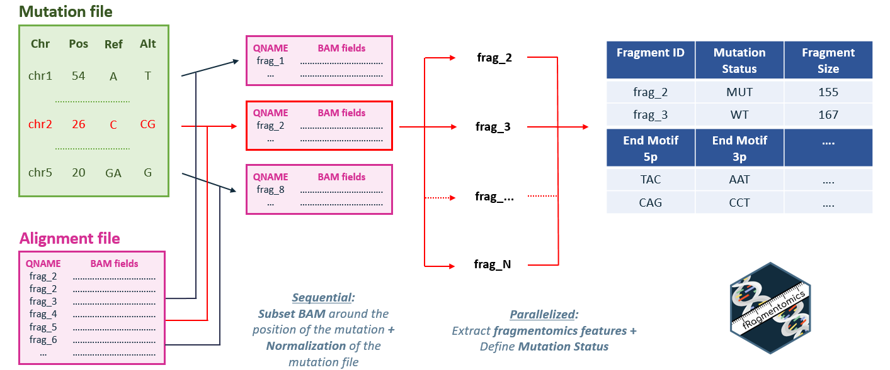
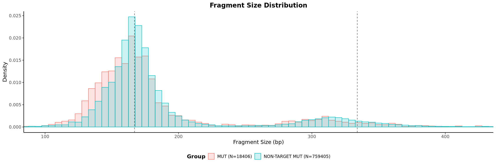
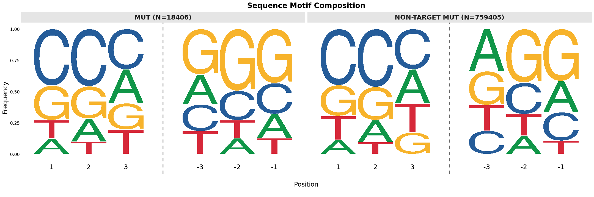
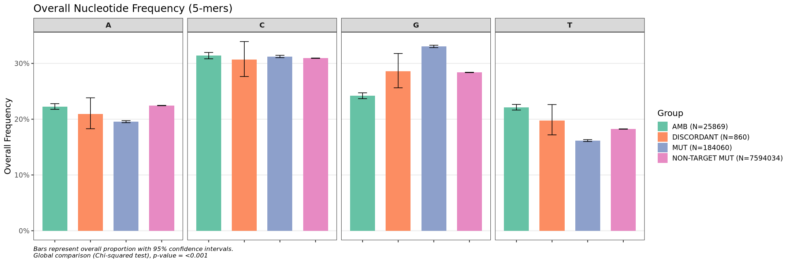
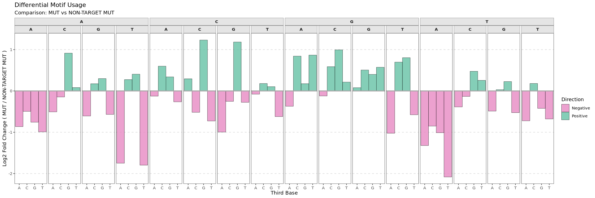
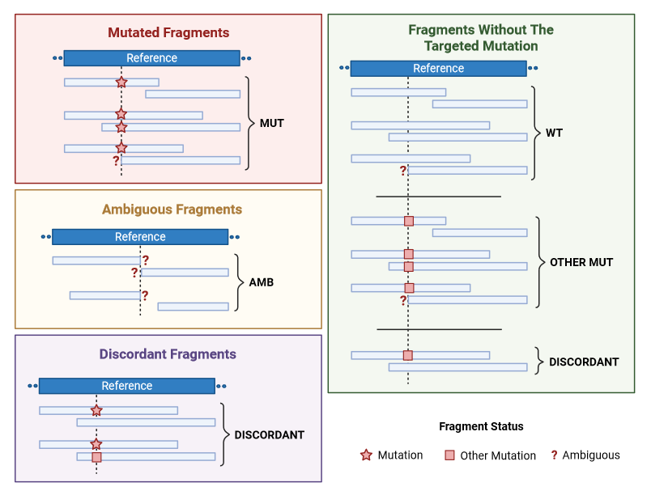
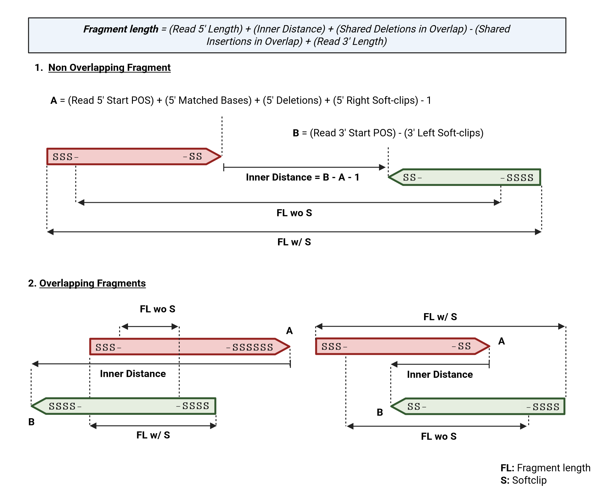

# fRagmentomics 


[](https://codecov.io/gh/ElsaB-Lab/fRagmentomics)

## Overview

Plasma circulating cell-free DNA (cfDNA) analysis has transformed cancer care. The majority of cfDNA originates from hematopoietic cells, which complicates the interpretation of circulating tumor DNA (ctDNA) in the absence of matched sequencing from white blood cells. Recent work has demonstrated that ctDNA fragments have distinct size distribution profiles and 5’/3’ end sequences compared to healthy cfDNA fragments.

However, there is currently no published tool that standardizes an in-depth analysis of these fragmentomic features in relation to the mutational status of each fragment for SNV and Insertion/Deletion (Indels). This presents significant technical challenges, such as the lack of consensus on the representation and positioning of indels and the multiple approaches to calculating fragment size.

**fRagmentomics** provides a standardized and user-friendly R package that integrates cfDNA fragment features (size, end sequences) with their specific mutational status (for both SNVs and indels). By providing a framework for per-fragment analysis, fRagmentomics aims to support the interpretation of liquid biopsies and to help determine the origin of cfDNA fragments.

---

## Installation

### Prerequisites

fRagmentomics is built and tested under **R version 4.4.3**.

### System Dependencies

fRagmentomics requires **`bcftools` (version 1.21 recommended)** for variant normalization. Please, ensure it is installed and accessible in your system's PATH.

We recommend using mamba for faster installation, but you can also use conda by replacing mamba by conda in the command:

```sh
# conda install -c bioconda mamba
mamba install -c bioconda bcftools=1.21
```

### R Package Installation

**1. Install Dependencies**

First, install all required packages from CRAN and Bioconductor using the `BiocManager` package.

```r
if (!requireNamespace("BiocManager", quietly = TRUE))
    install.packages("BiocManager")

# A single command to install all required packages
BiocManager::install(c(
    "devtools", "Rsamtools", "GenomicRanges", "Biostrings", "IRanges", "ggseqlogo",
    "GenomeInfoDb", "dplyr", "ggplot2", "tidyr", "stringr", "purrr", "future", "future.apply",
    "progressr", "RColorBrewer", "magrittr", "ggh4x", "tibble", "scales", "readr"
))
```

**2. Install fRagmentomics**

Finally, install fRagmentomics directly from GitHub.

```r
devtools::install_github("ElsaB-Lab/fRagmentomics")
```

After these steps are complete, you can load the package into your R session with `library(fRagmentomics)`.

---

## Input

1.  **`bam`**: Path to BAM file containing **paired-end** reads from a **targeted sequencing panel**.
    The function `analyze_fragments` preprocesses the BAM file to select reads relevant to each mutation. By default:
    * It only considers reads within a **2000 bp window** around the variant's position (configurable with `neg_offset_mate_search = -1000` and `pos_offset_mate_search = 1000`).
    * It applies a default filter to keep only primary, paired reads while removing unmapped, secondary, supplementary, and duplicate alignments. This corresponds to the default settings of the `flag_bam_list` argument.
    **Note**: All of these filtering parameters can be customized when calling the `analyze_fragments()` function.
<br>

2.  **`mut`**: Specifies the mutations to be analyzed. Three input formats are supported:
    * A path to a **VCF** file (e.g., `variants.vcf` or `variants.vcf.gz`).
    * A path to a **TSV** file (e.g., `mutations.tsv` or `mutations.tsv.gz`) containing at least the columns `CHROM`, `POS`, `REF`, and `ALT`.
    * A single **string** in the format `"chr:pos:ref:alt"`.

    The package accepts mutation positions in either **1-based** or **0-based** coordinates and normalizes them to the conventional 1-based system for analysis.

    For indels, the package can handle several positional conventions and allele representations. The following table summarizes the accepted formats:

    <br>

    **Simple Format**

    | To describe a...         | `REF` Column                      | `ALT` Column                      | `POS` Column                               |
    |:-------------------------|:----------------------------------|:----------------------------------|:-------------------------------------------|
    | Deletion of **"AT"** | `AT`                              | `""` (empty), `-`, `.`, `_`, `NA`  | Position of the first deleted base (`A`)   |
    | Insertion of **"CT"** | `""` (empty), `-`, `.`, `_`, `NA`  | `CT`                              | Position of the base *before* the insertion |

    **VCF-Style Padded Format**

    | To describe a...                   | `REF` Column | `ALT` Column | `POS` Column                                |
    |:-----------------------------------|:-------------|:-------------|:--------------------------------------------|
    | Deletion of **"AT"** from "G**AT**"  | `GAT`        | `G`          | Position of the anchor base (`G`)           |
    | Insertion of **"CT**" after "A"    | `A`          | `ACT`        | Position of the anchor base (`A`)           |

    **Important**: Regardless of the input format, fRagmentomics normalizes all variants using **`bcftools norm`**. This process ensures that indels are **left-aligned** and have a **standardized representation**. This is critical for matching the variant to sequences observed in the BAM file. After normalization, the position of an indel will correspond to the base preceding the event, and both `REF` and `ALT` alleles will be padded with this anchor base, following the VCF standard. For more details, see [Tan A, et al. 2015](https://doi.org/10.1093/bioinformatics/btv112).

    <br>

3.  **`fasta`**: A path to the reference genome FASTA file. This must be the same reference file that was used to align the BAM file. An index (`.fai`) is required and will be created if not found.

---

## Workflow

The main function is `analyze_fragments()`.



---

## Output

fRagmentomics can extract mutational informations and fragmentomics features for each fragment. The output is a dataframe, one line per fragment, containing:

### Mutation informations

   * **`Chromosome`**/**`Position`**/**`Ref`**/**`Alt`**: Mutation information **after** the normalisation.
   * **`Input_Mutation`**: Input mutation information.


### Fragment mutational status

For more details, see [Definition of Fragment Status](#definition-of-fragment-status).

   * **`Read_5p_Status`** & **`Read_3p_Status`**: Mutation status of each read in "MUT", "WT", "NA", "AMB" and "DISCORDANT".
   * **`Fragment_Status_Detail`**: Mutation status of the fragment. Created by concatenating the `Read_5p_Status` and `Read_3p_Status` if they are different.
   * **`Fragment_Status_Simple`**: Mutation status of the fragment in "MUT", "NON-TARGET MUT", "AMB" and "DISCORDANT".
   * **`BASE_5p`**/**`BASQ_5p`** & **`BASE_3p`**/**`BASQ_3p`**:

        | Variant Type          | Base and Base Quality Represented        |
        |-----------------------|-----------------------|
        | SNV | The ALT base at the variant position |
        | MNV | ALT bases covering all variant positions |
        | INS | Base before the insertion + inserted bases |
        | DEL | Base before the deletion |

   * **`VAF`**: The **Variant Allele Frequency** for the mutation, expressed as a percentage.
       >**VAF** = 100 * (`Number of MUT Fragments`) / (`Number of MUT Fragments` + `Number of NON-TARGET MUT Fragments`)

       **Important Note on the Calculation:**
       * The denominator includes **all** fragments that cover the position but do not carry the specific mutation of interest (`NON-TARGET MUT`). This means it counts both:
           1.  Fragments that match the **reference (wild-type) allele**.
           2.  Fragments that carry **another different mutation** at the same position (a third allele).
           3.  Fragments that carry **discordant informations** but never with the mutation of interest (WT/OTH).

       This approach differs from another conventional VAF calculation that might only use reference-matching fragments in the denominator.


### Fragmentomics features of the fragment

For more details, see [Definition of Fragment Size](#definition-of-fragment-size).

   * **`Fragment_Size`**
   * **`Fragment_Bases_5p/3p`** & **`Fragment_Basqs_5p/3p`**: The first and last `n` bases/qualities of the fragment's ends. The number `n` is set by the `report_5p_3p_bases_fragment` argument (included if `n` > 0).

### Other informations

   * **`Sample_Id`**: The user-provided sample identifier. (Included if the `sample_id` argument is set).
   * **`Fragment_Id`**: The read name (QNAME) that identifies the fragment.
   * **`Fragment_QC`**: The quality control status. Will be `"OK"` for valid pairs or will contain a message describing the reason for failure.

   * **`FLAG_5p/3p`**, **`MAPQ_5p/3p`**, **`CIGAR_5p/3p`**, **`POS_5p/3p`**: Alignment information for each read (Flag, Mapping Quality, CIGAR string, and Position), taken from the BAM file.

   * **`TLEN`**: The fragment's template length. (Included if `report_tlen = TRUE`).
   * **`Nb_Fragment_Bases_Softclip_5p/3p`**: The number of soft-clipped bases at the 5' and 3' ends of the fragment. (Included if `report_softclip = TRUE`).

---

## Quick Start

This example demonstrates a basic workflow using the main `analyze_fragments()` function. We will use the example data files included with the fRagmentomics package.

First, load the library and locate the example files using `system.file()`.

```r
library(fRagmentomics)

# Locate the example files bundled with the package
mut_file <- system.file(
  "extdata", "mutations_cfdna-test-01_chr1_27433000_27435000.tsv",
  package = "fRagmentomics"
)
bam_file <- system.file(
  "extdata", "cfdna-test-01_chr1_27433000_27435000.bam",
  package = "fRagmentomics"
)
fasta_file <- system.file(
  "extdata", "hg19_chr1_27433000_27435000.fa",
  package = "fRagmentomics"
)
```

Now, run the main analysis function with these files. We'll use 2 cores for this example.

```r
# Run the full analysis pipeline
results_df <- analyze_fragments(
    mut = mut_file,
    bam = bam_file,
    fasta = fasta_file,
    sample_id = "cfdna-test-01",
    n_cores = 2
)

# View the first few rows of the output data frame
head(results_df)
```

The resulting `results_df` data frame contains the per-fragment analysis, ready for exploration and visualization with the package's plotting functions. You can also save this data frame to a tab-separated (`.tsv`) file by providing a path to the `output_file` argument.

---

## Visualizations

fRagmentomics includes plotting functions to help you visualize the fragmentomic features generated by `analyze_fragments()`. All plotting functions take the output data frame as their input.

### 1. Fragment Size Distribution

The `plot_size_distribution()` function generates density plots or histograms to compare the distribution of fragment lengths between different groups (e.g., `MUT` vs. `NON-TARGET MUT`).

```r
# Assuming 'results_df' is the output from analyze_fragments()
plot_size_distribution(
  df_fragments = results_df,
  vals_z = c("MUT", "NON-TARGET MUT"),
  show_histogram = TRUE,
  show_density = FALSE,
  x_limits = c(100, 420),
  density_args = list(linewidth = 1.4),
  histo_args = list(alpha = 0.2)
)
```



### 2. End Motif Sequence Logos

The `plot_qqseqlogo_meme()` function creates sequence logo plots to visualize the nucleotide frequency at each position of the fragment ends.

```r
# Plot the sequence logo for the first 6 bases of the 5' end
plot_qqseqlogo_meme(
  df_fragments = results_df,
  motif_size = 3,
  vals_z = c("MUT", "NON-TARGET MUT")
)
```



### 3. Overall Nucleotide Frequency

The `plot_freq_barplot()` function creates a faceted bar plot to show the overall proportion of A, C, G, and T within the terminal motifs of fragments.

```r
# Analyze the overall nucleotide frequency in the first 5 bases
plot_freq_barplot(
  df_fragments = results_df,
  motif_size = 5
)
```



### 4. Detailed 3-Base Motif Proportions

The `plot_motif_barplot()` function shows the frequency of specific 3-base motifs at fragment ends. It has three visualization modes (`representation`): a hierarchical plot (default), a differential log2 fold-change plot, and a side-by-side comparison plot.

```r
# Use the default hierarchical representation to visualize 3-mer proportions
plot_motif_barplot(
  results_df,
  representation = "differential", 
  vals_z = c("MUT", "NON-TARGET MUT")
)
```



---

## Explanation of Mutational Status

A key feature of fRagmentomics is its method for determining the mutational status of each read. A simple check of the base at a variant's position is often insufficient.

### The Challenge: Ambiguity in Short Reads

Interpreting a variant requires analyzing its surrounding nucleotide context, not just the variant site itself. For SNVs and MNVs, this means checking the adjacent bases to ensure a simple mutation is not part of a larger event. For MNVs and indels, a read is considered truly informative if it covers the entire variant and some of its flanking sequence, which is essential for resolving potential ambiguities.

**An Example of Indel Ambiguity**

Consider a 2 bp insertion (`GG`) in a repetitive sequence context:

```
Reference:   A G G G T C C
Variant:     Pos 1, A > AGG (an insertion of 'GG')
Mutant Allele: A G G G G G T C C
```

Now, imagine a read aligns to this position at the end of it's sequence. If the read sequence is `AGGG`, which of these is correct?
1.  It perfectly matches the **reference** allele (`A G G G T C C`).
2.  It partially matches the **mutant** allele (`A G G G G G T C C`).

Without seeing the first nucleotide that breaks the repeted sequence, here `T`, it's impossible to be certain. The read is **ambiguous**.

### The fRagmentomics Solution: Context-Aware Comparison

To solve this problem, fRagmentomics uses a context-aware algorithm instead of a simple base check.

**1. Dynamic Comparison Length**

For each indel and MNV, the function first calculates the **minimum required sequence length** needed to unambiguously confirm the variant. This calculation considers both the size of the variant and the surrounding sequence (e.g., tandem repeats).

**2. Template Generation & Comparison**

The function then generates two "perfect" template sequences of this required length:

* A **wild-type template** based on the reference genome.
* A **mutant template** representing the variant allele.

The sequence of the aligned read is then compared against these two templates. A read is only considered a high-confidence match (`MUT`) if it is long enough to cover the entire template sequence.

**3. Definition of Read Status**

The final `Read_5p_Status` and `Read_3p_Status` are assigned based on this comparison, distinguishing between reads that provide complete or only partial evidence.

| Read Evidence                                   | Matches Wild-Type Template? | Matches Mutant Template? | Final `Read Status` |
|:------------------------------------------------|:---------------------------:|:------------------------:|:--------------------|
| Read is long enough (**Complete Evidence**)     |             Yes             |            No            | `WT`                |
| Read is long enough (**Complete Evidence**)     |             No              |           Yes            | `MUT`               |
| Read is too short (**Partial Evidence**)        |             Yes             |        Yes or No         | `WT`                |
| Read is too short (**Partial Evidence**)        |             No              |           Yes            | `AMB` (Ambiguous)   |
| Any Read                                        |             No              |            No            | `OTH` (Other)       |
| Any Read                                        |             Yes             |           Yes            | `AMB` (Ambiguous)   |
| Read does not cover the position at all         |             -               |            -             | `NA`                |

* **Special Case for SNVs/MNVs**: If a read perfectly matches a target SNV or MNV but also has *another* mutation immediately adjacent to it, it is flagged as `"MUT but potentially larger MUT"`. This helps identify cases where a variant might be part of a more complex, unannotated event.

### Definition of Fragment Status

**1. Fragment Status Detail**

This column provides a summary of the evidence by concatenating the statuses of the two reads that form the fragment. For example, if one read is `MUT` and the other is `AMB`, the detail status will be `"MUT & AMB"`. If one read does not cover the locus (`NA`), this column will show the status of the other read.

**2. Fragment Status Simple**

This column provides a single, high-level interpretation of the fragment's state. It categorizes each fragment into one of the following groups:

* **`MUT`**: The fragment supports the **mutant allele**. This is the case when both reads are `MUT`, or when one is `MUT` and the other is ambiguous or `NA`.

* **`NON-TARGET MUT`**: The fragment confidently supports an allele that is **not the target mutation**. This category is assigned in any of the following cases:
    * Both reads support the **wild-type** allele (`WT`).
    * Both reads support **non-target mutation** (`OTH`).
    * One read is **wild-type** (`WT`) and the other has a **non-target mutation** (`OTH`).

* **`DISCORDANT`**: The two reads of the fragment provide conflicting information. This may indicate a sequencing or alignment artifact.

* **`AMB`**: The status of the fragment is **ambiguous**. This occurs when the evidence is not strong enough to make a high-confidence call for any specific allele (e.g., both reads are ambiguous).

For the VAF calculation, fRagmentomics uses the `NON-TARGET MUT` category in the denominator. This is a key distinction from simpler methods, as `NON-TARGET MUT` includes not only wild-type (`WT`) fragments but also those with non-target mutations (`OTH`). See the [Fragment Mutational Status](#fragment-mutational-status) section.



---

## Explanation of Fragment Size

### An Indel-Aware Method

The concept of fragment length can be ambiguous as noted in the [official SAM/BAM file format documentation](https://samtools.github.io/hts-specs/SAMv1.pdf). The `TLEN` field represents the span of the alignment on the **reference genome**, not the true length of the sequenced DNA molecule. To address this, fRagmentomics calculates a fragment size by directly reconstructing the fragment from its aligned reads, accounting for any indels or overlaps.

The size is calculated by summing the lengths of the 5' and 3' reads and the inner distance (gap or overlap) between them. If the reads overlap, the formula makes a correction for any indels within that region to avoid miscounting them.

To calculate the fragment size, `fRagmentomics` first determines the inner boundaries of each read's alignment on the reference genome.

> **1. Read 5' Inner Boundary** = (`Read 5' Start POS`) + (`5' Matched Bases`) + (`5' Deletions`) + (`5' Right Soft-clips`) - 1
> **2. Read 3' Inner Boundary** = (`Read 3' Start POS`) - (`3' Left Soft-clips`)
> **3. Inner Distance** = (`Read 3' Inner Boundary`) - (`Read 5' Inner Boundary`) - 1

> **Fragment Size** = (`Read 5' Length`) + (`Inner Distance`) + (`Shared Deletions in Overlap`) - (`Shared Insertions in Overlap`) + (`Read 3' Length`)

### Handling Soft-Clipped Bases

Soft-clipped bases at the ends of a fragment can be ambiguous. They may represent:

* **Technical artifacts**.
* **True biological variation**, like a terminal indel that was classified as a soft-clip by the aligner.

The fragment size calculation first determines the full alignment span of each read on the reference genome. This span is calculated from the CIGAR string and **includes all soft-clipped bases**, both at the "internal" ends (3'-end of the 5' read, 5'-end of the 3' read) and the "external" ends of the fragment.

This method handles complex cases. For example, when a DNA fragment is shorter than the read length, the sequencer reads into the adapter sequence, which the aligner then soft-clips ([see documentation](https://knowledge.illumina.com/library-preparation/general/library-preparation-general-reference_material-list/000003874)). In this scenario, the "internal" soft-clip defines the read's full alignment span on the reference. The `Inner Distance` calculation then  identifies a large overlap, and the final `Fragment Size` formula resolves to the true, short fragment length.

The `remove_softclip` argument gives you control over how to treat the **external soft-clips only**:

* **`remove_softclip = FALSE`** (Default): External soft-clipped bases are considered part of the original DNA molecule. The size calculation will include them in the fragment's total span.

* **`remove_softclip = TRUE`**: External soft-clipped bases are treated as technical artifacts. They are trimmed from the reads *before* any size calculation or other analysis occurs.



---

## Contributing and Bug Reports

We welcome contributions and feedback from the community!

If you encounter a bug or have an idea for a new feature, please open an issue on our [GitHub Issues page](https://github.com/ElsaB-Lab/fRagmentomics/issues).

---

## License

This project is licensed under the **GPL-3.0 License**. See the LICENSE file for more details.
