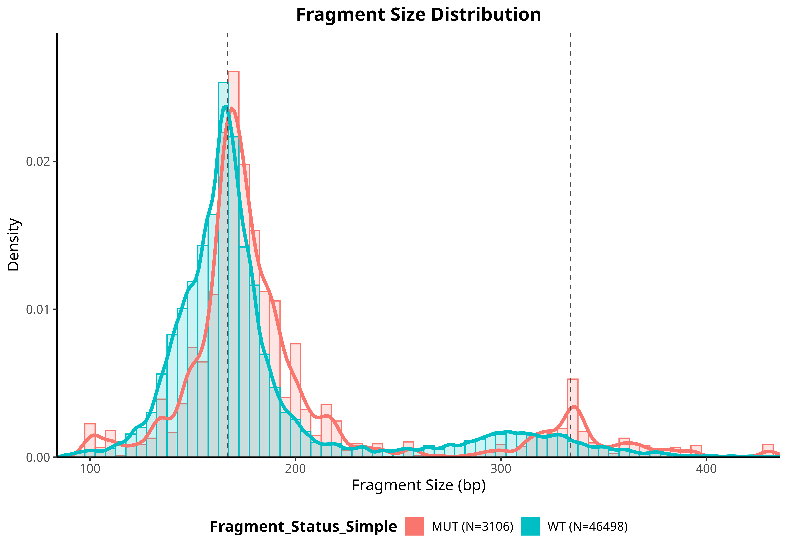
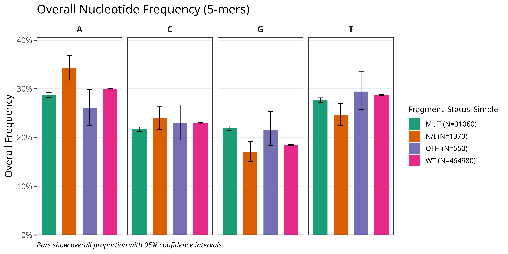
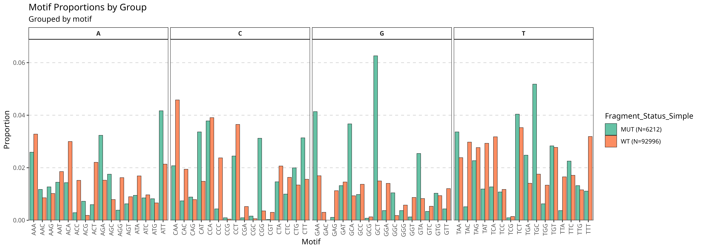
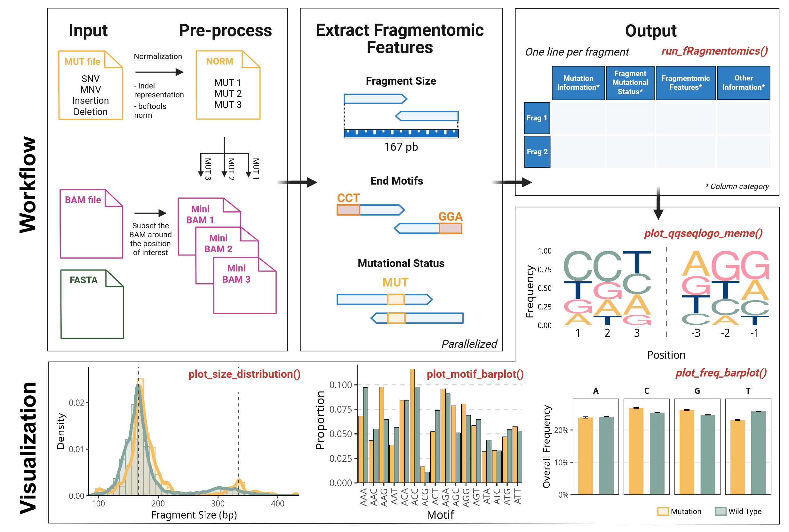

# fRagmentomics 


[](https://codecov.io/gh/ElsaB-Lab/fRagmentomics)
[](https://github.com/pre-commit/pre-commit)
[](https://github.com/r-lib/styler)
[](https://github.com/prettier/prettier)
[](https://www.gnu.org/licenses/gpl-3.0)
[](https://doi.org/10.5281/zenodo.18679583)

- [Overview](#overview)
- [Installation](#installation)
  - [Prerequisites](#prerequisites)
  - [System Dependencies](#system-dependencies)
  - [R Package Installation](#r-package-installation)
- [Quick Start](#quick-start)
- [Visualizations](#visualizations)
  - [1. Fragment Size Distribution](#1-fragment-size-distribution)
  - [2. End Motif Sequence Logos](#2-end-motif-sequence-logos)
  - [3. Overall Nucleotide Frequency](#3-overall-nucleotide-frequency)
  - [4. Detailed 3-Base Motif Proportions](#4-detailed-3-base-motif-proportions)
- [Input](#input)
- [Workflow](#workflow)
- [Output](#output)
  - [All columns](#all-columns)
  - [¹ Details on `BASE` and `BASQ` Columns](#-details-on-base-and-basq-columns)
  - [² Details on Variant Allele Frequency (`VAF`) Calculation](#-details-on-variant-allele-frequency-vaf-calculation)
- [Explanation of Mutational Status assignment](#explanation-of-mutational-status-assignment)
  - [The Challenge: Ambiguity in Short Reads](#the-challenge-ambiguity-in-short-reads)
  - [The fRagmentomics Solution: Context-Aware Comparison](#the-fragmentomics-solution-context-aware-comparison)
  - [Definition of Fragment Status](#definition-of-fragment-status)
- [Explanation of Fragment Size](#explanation-of-fragment-size)
  - [An Indel-Aware Method](#an-indel-aware-method)
  - [Handling Soft-Clipped Bases](#handling-soft-clipped-bases)
- [Example Dataset: EGFR Exon 19 Deletion Case Study](#example-dataset-egfr-exon-19-deletion-case-study)
- [Contributing and Bug Reports](#contributing-and-bug-reports)
- [License](#license)

## Overview

Plasma circulating cell-free DNA (cfDNA) analysis has transformed cancer care. However, the majority of cfDNA originates from hematopoietic cells ([Mattox et al. Cancer Discov. 2023](https://aacrjournals.org/cancerdiscovery/article/13/10/2166/729365/The-Origin-of-Highly-Elevated-Cell-Free-DNA-in) and references therein), which complicates the analysis of cfDNA in the context of cancer, particularly, in the absence of matched sequencing of healthy cells (e.g white blood cells). Multiple studies in the past have demonstrated that circulating tumor DNA (ctDNA) fragments have distinct size distribution profiles and 5’/3’ end sequences ("end motifs") compared to healthy cfDNA fragments (see [Snyder et al. Cancer Cell. 2016](https://pubmed.ncbi.nlm.nih.gov/26771485/), [Mouliere et al. Sci Trans Med. 2018](https://pubmed.ncbi.nlm.nih.gov/30404863/), [Cristiano et al. Nature. 2019](https://pubmed.ncbi.nlm.nih.gov/31142840/))

Only a few tools are currently available to analyse fragmentomic features ([Wang et al. Genome Biol. 2025](https://genomebiology.biomedcentral.com/articles/10.1186/s13059-025-03607-5)), and to our knowledge, none provide an integrated solution for both extracting fragmentomic features and determining the mutational status of individual fragments across all classes of small variants, namely single-nucleotide variants (SNVs), multinucleotide variants (MNVs), and insertions/deletions (indels). This current gap exists largely because indel-aware fragment genotyping is particularly complex. Indels can be represented in multiple valid ways across alignments ([Tan et al. Bioinformatics.2015](https://academic.oup.com/bioinformatics/article/31/13/2202/196142?login=true)) and short reads often incompletely span the indel context, especially within repetitive regions, leading to ambiguous or conflicting evidence ([Narzisi et al.Frontiers. 2015](https://www.frontiersin.org/journals/bioengineering-and-biotechnology/articles/10.3389/fbioe.2015.00008/full)).

_fRagmentomics_ fills the gap by providing an integrated framework that simultaneously derives fragmentomic descriptors (e.g. length, 5′/3′ end motifs, inner distance, genomic coordinates) and assigns a mutation status to each fragment based on a user-specified list of small mutations of any type. Furthermore, _fragmentomics_ addresses the complexity of determining exactly the fragment size which, because of indels, is more involved than a simple difference between the aligned positions of the fragment boundaries ([official SAM/BAM file format documentation](https://samtools.github.io/hts-specs/SAMv1.pdf)).

---

## Installation

### Prerequisites

fRagmentomics is built and tested under **R version 4.4.3**.

### System Dependencies

fRagmentomics optionally makes use **`bcftools`** (tested with version 1.21) for variant normalization. If using
`apply_bcftools_norm=TRUE` argument, please, ensure it is installed and accessible in your system's PATH.

We recommend using a conda environment with bcftools installed but you can also use any other environment manager or
rely on tools already installed in your system.

```sh
# conda install -c conda-forge mamba
mamba install -c conda-forge -c bioconda bcftools=1.21
```

### R Package Installation

You may install the package from github or from conda.

**1. Install from conda**

```r
# To use bcftools normalisation (RECOMMENDED for indels)
mamba env create -n fRagmentomics-env -c elsab-lab -c conda-forge -c bioconda r-fragmentomics bcftools=1.21
```

**2. Install from github**

When installing from GitHub, pre-installing heavy Bioconductor deps via Conda can avoid slow source compilation.

```bash
Rscript -e 'if (!requireNamespace("remotes", quietly=TRUE))
              install.packages("remotes", repos="https://mirror.ibcp.fr/pub/CRAN/");
            remotes::install_github("ElsaB-Lab/fRagmentomics", build_vignettes=FALSE, upgrade="never")'
```

NOTE: If you hit compilation issues (e.g. with Rsamtools / BiocParallel), try one of the two approaches below.

- **With Conda/Mamba** (preinstall Rsamtools)

```bash
mamba env create -n fRagmentomics-env -c conda-forge -c bioconda bioconductor-rsamtools bcftools=1.21 # To use bcftools normalisation (RECOMMENDED for indels)
mamba activate fRagmentomics-env
Rscript -e 'if (!requireNamespace("BiocManager", quietly=TRUE))
              install.packages("BiocManager", repos="https://mirror.ibcp.fr/pub/CRAN/");
            if (!requireNamespace("remotes", quietly=TRUE))
              install.packages("remotes", repos="https://mirror.ibcp.fr/pub/CRAN/");
            remotes::install_github("ElsaB-Lab/fRagmentomics", build_vignettes=FALSE, upgrade="never")'
```

- **Without Conda/Mamba** (use BiocManager to get Bioconductor deps)

```bash
Rscript -e 'if (!requireNamespace("BiocManager", quietly=TRUE))
              install.packages("BiocManager", repos="https://mirror.ibcp.fr/pub/CRAN/");
            if (!requireNamespace("remotes", quietly=TRUE))
              install.packages("remotes", repos="https://mirror.ibcp.fr/pub/CRAN/");
            BiocManager::install(c("Rsamtools","GenomicAlignments","BiocParallel"), ask=FALSE, update=FALSE);
            remotes::install_github("ElsaB-Lab/fRagmentomics", build_vignettes=FALSE, upgrade="never")'
```

After these steps are complete, you can load the package into your R session with `library(fRagmentomics)`.

---

## Quick Start

This example demonstrates a basic workflow using the main `run_fRagmentomics()` function. We will use the example data files included with the fRagmentomics package.

First, load the library and locate the example files using `system.file()`.

```r
library(fRagmentomics)

# Locate the example files bundled with the package
mut_file = system.file("extdata/mutation",
  "cfdna-egfr-del_chr7_55241864_55243064_10k.mutations.tsv",
  package = "fRagmentomics"
)
bam_file = system.file("extdata/bam",
  "cfdna-egfr-del_chr7_55241864_55243064_10k.bam",
  package = "fRagmentomics"
)
fasta_file = system.file("extdata/fasta",
  "hg19_chr7_55231864_55253064.fa",
  package = "fRagmentomics"
)
```

Now, run the main analysis function with these files. We'll use 2 cores for this example.

```r
# Run the full analysis pipeline
df_fragments <- run_fRagmentomics(
    mut = mut_file,
    bam = bam_file,
    fasta = fasta_file,
    sample_id = "cfdna-egfr-del",
    apply_bcftools_norm = TRUE,
    n_cores = 1
)
```

<!-- The resulting `df_fragments` data frame contains the per-fragment analysis, ready for exploration and visualization with the package's plotting functions. You can also save this data frame to a tab-separated (`.tsv`) file by providing a path to the `output_path` argument. -->

NOTE: Set `apply_bcftools_norm = TRUE` to resolve the ambiguity in indel representation and position via `bcftools norm` (left-alignment).
This requires `bcftools` to be installed and available on your `PATH` (see **Installation**). If you disable it (`FALSE`), indel coordinates will **not** be left-aligned or normalized, which can affect downstream comparisons and metrics.

---

## Visualizations

fRagmentomics includes plotting functions to help you visualize the fragmentomic features generated by `run_fRagmentomics()`. All plotting functions take the output data frame as their input.

### 1. Fragment Size Distribution

The `plot_size_distribution()` function generates density plots or histograms to compare the distribution of fragment lengths between different groups (e.g., `MUT` vs. `WT`).

```r
# Assuming 'df_fragments' is the output from run_fRagmentomics()
plot_size_distribution(
  df_fragments,
  vals_z = c("MUT", "WT"),
  show_histogram = TRUE,
  show_density = TRUE,
  x_limits = c(100,420),
  histo_args = list(alpha = 0.25),
  density_args = list(linewidth = 2),
  histogram_binwidth = 10,
  colors_z = c("#F6BD60", "#84A59D")
)
```



### 2. End Motif Sequence Logos

The `plot_ggseqlogo_meme()` function creates sequence logo plots to visualize the nucleotide frequency at each position of the fragment ends.

```r
# Plot the sequence logo for the first 3 bases in 5p and 3p ends of the MUT and WT fragments
plot_ggseqlogo_meme(
  df_fragments,
  motif_size = 3,
  motif_type = "Both",
  col_z  = "Fragment_Status_Simple",
  vals_z = c("MUT", "WT"),
  colors_z = c("#F6BD60", "#84A59D", "#FD96A9", "#083D77")
)
```


### 3. Overall Nucleotide Frequency

The `plot_freq_barplot()` function creates a faceted bar plot to show the overall proportion of A, C, G, and T within the terminal motifs of fragments.

```r
# Analyze the overall nucleotide frequency in the bases of the 5-bases start and end sequences of the MUT and WT fragments
plot_freq_barplot(
  df_fragments,
  motif_size = 5,
  motif_type = "Both", # can be changed to "Start" or "End"
  col_z  = "Fragment_Status_Simple",
  vals_z = c("MUT", "WT"),
  colors_z = c("#F6BD60", "#84A59D")
)
```



### 4. Detailed 3-Base Motif Proportions

The `plot_motif_barplot()` function shows the frequency of specific 3-base motifs at fragment ends. It has three
visualization modes (`representation`):

1. `representation="split_by_base"` bars are split hierarchically by first, second, and third base and each
   fragment category has its own facet (default).
2. `representation="split_by_motif" `bars are grouped by fragment categories across each motif and motifs are sorted
   alphabetically.
3. `representation="differential"` bars are split hierarchically by first, second, and third base and bars height
   represent a log2 fold-change plot between two fragment categories (supports only two categories).

```r
# Use the default hierarchical representation to visualize 3-mer proportions of the MUT fragments
plot_motif_barplot(
  df_fragments,
  motif_type = "Both",
  representation = "split_by_base",
  vals_z = "MUT",
  colors_z = c("#F6BD60", "#84A59D", "#FD96A9", "#083D77")
)
```


```r
# Use the side-by-side representation to visualize 3-mer proportions
plot_motif_barplot(
  df_fragments,
  motif_type = "Both",
  representation = "split_by_motif",
  motif_start = c("A", "C"),
  vals_z = c("MUT", "WT"),
  colors_z = c("#F6BD60", "#84A59D")
)

```



```r
# Use the differential representation to visualize 3-mer proportions
plot_motif_barplot(
  df_fragments,
  representation = "differential",
  vals_z = c("MUT", "WT")
)
```


---

## Input

1.  **`bam`**: Path to BAM file containing **paired-end** reads (the package has so far only been tested on BAM files
    from experiments of targeted sequencing of cfDNA).
    The function `run_fRagmentomics` preprocesses the BAM file to select reads relevant to each mutation. By default:

    - It only considers reads within a user-configurable window (default=2000 bp window, 1000 bp before - `neg_offset_mate_search` and 1000bp after - `pos_offset_mate_search`).
    - It applies a default filter to keep only paired reads (not to be confounded with "properly paired reads") while removing unmapped, secondary and supplementary alignments. This corresponds to the default settings of the `flag_bam_list` argument.

      **NOTE**: The above filtering parameters can be customized when calling the `run_fRagmentomics()` function.

    <br>

2.  **`mut`**: Specifies the mutations to be analyzed. Three input formats are supported:

    - A path to a **VCF** file (e.g., `variants.vcf` or `variants.vcf.gz`)

    or

    - A path to a **TSV** file (e.g., `mutations.tsv` or `mutations.tsv.gz`) containing at least the columns `CHROM`, `POS`, `REF`, and `ALT`.

    or

    - A single **string** in the format `"chr:pos:ref:alt"`.

    The package accepts mutation positions in either **1-based** or **0-based** (in that case the user must set the
    argument `one_based=FALSE`) coordinates and normalizes them to the conventional 1-based system for analysis.

    For indels, the package can handle several positional conventions and allele representations. The following table summarizes the accepted formats:

    <br>

    **Simple Format**

    | Mutation              | `REF` Column              | `ALT` Column              | `POS` Column                                |
    | :-------------------- | :------------------------ | :------------------------ | :------------------------------------------ |
    | Deletion of **"AT"**  | `AT`                      | `""`, `-`, `.`, `_`, `NA` | Position of the first deleted base (`A`)    |
    | Insertion of **"CT"** | `""`, `-`, `.`, `_`, `NA` | `CT`                      | Position of the base _before_ the insertion |

    **VCF-Style Padded Format**

    | Mutation                            | `REF` Column | `ALT` Column | `POS` Column                      |
    | :---------------------------------- | :----------- | :----------- | :-------------------------------- |
    | Deletion of **"AT"** from "G**AT**" | `GAT`        | `G`          | Position of the anchor base (`G`) |
    | Insertion of **"CT**" after "A"     | `A`          | `ACT`        | Position of the anchor base (`A`) |

    **Important**: Regardless of the input format, fRagmentomics optionally (recommended but deactivated by default to allow for
    an execution free of any system dependency) normalizes all variants using **`bcftools norm`**. We **strongly
    recommend** systematically setting `apply_bcftools_norm=TRUE` when executing `run_fRagmentomics` function. This
    process ensures that indels are **left-aligned** and have a **standardized representation**. This is critical for
    matching the variant to sequences observed in the BAM file. After normalization, the position of an indel will
    correspond to the base preceding the event, and both `REF` and `ALT` alleles will be padded with this anchor base,
    following the VCF standard. For more details, see [Tan A, et al.
    2015](https://doi.org/10.1093/bioinformatics/btv112).

    <br>

3.  **`fasta`**: A path to the reference genome FASTA file. This must be the same reference file that was used to align
    the BAM file. The fasta index (`.fai`) will be created if not found.

---

## Workflow

The main function is `run_fRagmentomics()`.



---

## Output

fRagmentomics can extract informations about the mutational status and fragmentomic features for each fragment. The
output is a dataframe with one line per fragment and the following headers:

### All columns

---

| Column                                                             | Description                                                                                                        |
| :----------------------------------------------------------------- | :----------------------------------------------------------------------------------------------------------------- |
| **_Mutation Information_**                                         |                                                                                                                    |
| 1 - `Sample_Id`                                                    | User-provided sample identifier.                                                                                   |
| 2 - `Chromosome`                                                   | Chromosome of the mutation **after** normalization.                                                                |
| 3 - `Position`                                                     | Start position of the mutation **after** normalization.                                                            |
| 4 - `Ref`                                                          | Reference allele **after** normalization.                                                                          |
| 5 - `Alt`                                                          | Alternate allele **after** normalization.                                                                          |
| 6 - `Input_Mutation`                                               | The original mutation information as provided in the input file.                                                   |
| **_Fragment & Read Status_**                                       |                                                                                                                    |
| 7 - `Fragment_Id`                                                  | The read name (QNAME) that uniquely identifies the DNA fragment.                                                   |
| 8 - `Fragment_QC`                                                  | Quality control status. Is `"OK"` for valid pairs or contains a failure reason.                                    |
| 9 - `Fragment_Status_Simple`                                       | Simplified mutation status of the fragment ("MUT", "WT", "OTH", "N/I").                                            |
| 10 - `Fragment_Status_Detail`                                      | Detailed mutation status, created by concatenating read statuses if they differ.                                   |
| 11 - `Read_5p_Status`                                              | Mutation status for the 5' read ("MUT", "WT", "OTH", "AMB", "[MUT/WT/OTH] by CIGAR but potentially [MUT/WT/OTH]"). |
| 12 - `Read_3p_Status`                                              | Mutation status for the 3' read ("MUT", "WT", "OTH", "AMB", "[MUT/WT/OTH] by CIGAR but potentially [MUT/WT/OTH]"). |
| 13 - `BASE_5p`                                                     | Base(s) from the 5' read covering the variant position.[¹](#footnote1)                                             |
| 14 - `BASE_3p`                                                     | Base(s) from the 3' read covering the variant position.[¹](#footnote1)                                             |
| 15 - `BASQ_5p`                                                     | Base quality/qualities from the 5' read covering the variant position.[¹](#footnote1)                              |
| 16 - `BASQ_3p`                                                     | Base quality/qualities from the 3' read covering the variant position.[¹](#footnote1)                              |
| 17 - `VAF`                                                         | Variant Allele Frequency, expressed as a percentage.[²](#footnote2)                                                |
| **_Fragmentomic & Alignment Features_**                            |                                                                                                                    |
| 18 - `Fragment_Size`                                               | The size of the DNA fragment.                                                                                      |
| 19 - `Position_5p`                                                 | 1-based leftmost mapping position of the 5' read.                                                                  |
| 20 - `Position_3p`                                                 | 1-based rightmost mapping position of the 3' read.                                                                 |
| 21 - `Fragment_Bases_5p` (if `report_5p_3p_bases_fragment` > 0)    | The first `n` bases from the 5' end of the fragment.                                                               |
| 22 - `Fragment_Bases_3p` (if `report_5p_3p_bases_fragment` > 0)    | The last `n` bases from the 3' end of the fragment.                                                                |
| **_Bam Information_** (if `report_bam_info` = TRUE)                |                                                                                                                    |
| 23 - `POS_5p`                                                      | 1-based leftmost mapping position of the 5' read.                                                                  |
| 24 - `POS_3p`                                                      | 1-based leftmost mapping position of the 3' read.                                                                  |
| 25 - `FLAG_5p`                                                     | SAM flag for the 5' read.                                                                                          |
| 26 - `FLAG_3p`                                                     | SAM flag for the 3' read.                                                                                          |
| 27 - `MAPQ_5p`                                                     | Mapping quality for the 5' read.                                                                                   |
| 28 - `MAPQ_3p`                                                     | Mapping quality for the 3' read.                                                                                   |
| 29 - `CIGAR_5p`                                                    | CIGAR string for the 5' read.                                                                                      |
| 30 - `CIGAR_3p`                                                    | CIGAR string for the 3' read.                                                                                      |
| 31 - `TLEN`                                                        | Template length of the fragment, from the BAM file.                                                                |
| **_Other Information_**                                            |                                                                                                                    |
| 32 - `Fragment_Basqs_5p` (if `report_5p_3p_bases_fragment` > 0)    | The first `n` base qualities from the 5' end of the fragment.                                                      |
| 33 - `Fragment_Basqs_3p` (if `report_5p_3p_bases_fragment` > 0)    | The last `n` base qualities from the 3' end of the fragment.                                                       |
| 34 - `Nb_Fragment_Bases_Softclip_5p` (if `report_softclip` = TRUE) | Number of soft-clipped bases at the 5' end of the fragment.                                                        |
| 35 - `Nb_Fragment_Bases_Softclip_3p` (if `report_softclip` = TRUE) | Number of soft-clipped bases at the 3' end of the fragment.                                                        |

---

### <a name="footnote1"></a>¹ Details on `BASE` and `BASQ` Columns

The information represented in the `BASE` and `BASQ` columns depends on the variant type:

| Variant Type | Base and Base Quality Represented           |
| :----------- | :------------------------------------------ |
| **SNV**      | The ALT base at the variant position.       |
| **MNV**      | ALT bases covering all variant positions.   |
| **INS**      | Base before the insertion + inserted bases. |
| **DEL**      | Base before the deletion.                   |

<br>

### <a name="footnote2"></a>² Details on Variant Allele Frequency (`VAF`) Calculation

The **Variant Allele Frequency** is the percentage of fragments supporting the alternate allele compared to all informative fragments covering the variant site.

The formula used is:

> **VAF** = 100 \* (`Number of MUT Fragments`) / (`Number of MUT Fragments` + `Number of WT Fragments` + `Number of OTH Fragments`)

**NOTE:**
The denominator includes **all** fragments that reliably cover the mutation's position i.e.

1.  Fragments that carry **the mutation of interest** (MUT).
2.  Fragments that match the **reference allele** (WT).
3.  Fragments that carry **a different alteration** at the same position (a third allele).

---

## Explanation of Mutational Status assignment

A key feature of fRagmentomics is its method for determining the mutational status of each read. A simple check of the base at a variant's position is sufficient only for SNVs.

### The Challenge: Ambiguity in Short Reads

Interpreting a variant requires analyzing its surrounding nucleotide context, not just the variant site itself. For SNVs and MNVs, this means checking the adjacent bases to check if the mutation is not part of a larger event. For indels, a read is considered truly informative if it covers the entire variant and some of its flanking sequence, which is essential for resolving potential ambiguities.

**Examples of Indel Ambiguity**

Consider a 2 bp insertion (`GG`) in a repetitive sequence context:

```
Variant:    Pos 5, A > AGG (an insertion of 'GG' after anchor base 'A' at position 5)
Reference:  A T A G T A G G G T C C
Mutant:     A T A G T A G G G G G T C C
Read:       A T A G T A G G G
Read:       A T A G T A G G G G
Read:       A T A G T A G G G G G
Read:       A T A G T A G G G G G T
```

Now, imagine a read covering the positions of the insertion at the end of its sequence. Considering the read sequence starting from the insertion anchor base, i.e `AGGG`, which of these is correct?

1.  It supports the **reference** allele (`A G G G T C C`).
2.  It supports the **mutant** allele (`A G G G G G T C C`).

Without seeing the first nucleotide that breaks the repeated sequence, here `T`, it's impossible to be certain. The mutation status of the read is ambiguous.

Consider now a 3 bp deletion `(ACA)` in a repetitive context

```
Variant:    Pos 3, GACA > G (a deletion of 'ACA' after anchor base 'G' at position 3)
Reference:  G T G A C A A C A A G T C
Mutant:     G T G A C A A G T C
Read 1:     G T G A C A
Read 2:     G T G A C A A
Read 3:     G T G A C A A G
```

Now, imagine the three reads above covering the positions of the deletion at the end of its sequence. Considering the read sequence starting from the deletion anchor base, i.e `GACA` for read 1, `GACAA` for read 2, and `GACAAG` for read3, which of these is correct for each read?

1.  It supports the **reference** allele (`G A C A A C A A G T C`).
2.  It supports the **mutant** allele (`G A C A A G T C`).

How far should the read cover after the position of the anchor base to solve the ambiguity? The answer is to cover the first nucleotide that breaks the repeated sequence (`ACA`), i.e here the `G` at position 11. Therefore the ambiguity can only be resolved for read 3 here. The mutation statuses of read 1 and 2 will be ambiguous while read 3 will be mutated (MUT). Of note, we cannot rule a simple mutation `C>G` at position 8 which would result in the same read 3 as the deletion of `ACA` but we choose to prioritize the variant specified by the user which often consist in a variant known to exist in the sample and with therefore an priori much higher likelihood.

### The fRagmentomics Solution: Context-Aware Comparison

To solve this problem, fRagmentomics uses a **context-aware algorithm** instead of a simple base check. It defines the status of each read by combining **CIGAR information** and **sequence comparison** (for indels) or by using **sequence-only** (for SNVs/MNVs). The approach ensures that high-confidence evidence is prioritized while ambiguities and inconsistencies are flagged.

**1. Template Construction & Dynamic Comparison Length**

For each variant, two local templates are built:

- A **wild-type (WT) template** from the reference genome

- A **mutant (MUT) template** carrying the alternate allele

For each indel and SNV/MNV, the function first calculates the **minimum required sequence length** needed to unambiguously confirm the variant. This calculation considers both the size of the variant and the surrounding sequence (e.g., tandem repeats).

Unless `remove_softclipping = TRUE`, soft-clipped bases are included in the comparison.

**2. Sequence comparison rules**

- If the read matches only WT, it is labeled **WT**.

- If the read matches only MUT, it is labeled **MUT**.

- If the read matches neither, it is labeled **OTH** (non-target alteration).

- If the read appears to match both, it is labeled **AMB** (ambiguous).

Ambiguity typically arises when the read is too short to span the informative region, or when the variant occurs within a complex event. A high-confidence MUT requires complete observation of the alternate allele across the window.

**3. SNVs and MNVs**

SNVs/MNVs are called by sequence comparison only. If the target substitution is present but an adjacent mutation is also observed, the read is still labeled MUT, and a diagnostic flag is added in Fragment_Status_Detailed (e.g., "MUT but potentially larger MUT"). If an MNV is not fully covered, the read is labeled AMB.

**4. Indels: prioritizing CIGAR**

For indels, CIGAR evidence is prioritized.

If the CIGAR encodes the expected indel:

- Adopt the CIGAR-based call.

- Use sequence comparison as a concordance check.

- If the comparison disagrees or cannot resolve the case, attach a flag (e.g., "MUT by CIGAR but potentially WT").

If the CIGAR does not encode the indel:

- Fall back to the sequence comparison results.

- Attach a flag when the available sequence is insufficient.

**5. Read status**

**The first word** of the read status will be use to **define the fragment status**. We consider it as the main information of the read.

```
Read not covering the position of interest -> "NA"

Read covering the position of interest
  complete_comparison
    mutation found by CIGAR
      -> MUT by comparison  -> "MUT"
      -> WT  by comparison  -> "MUT by CIGAR but potentially WT"
      -> AMB by comparison  -> "IMPOSSIBLE"
      -> OTH by comparison  -> "MUT by CIGAR but potentially OTH"

    other found by CIGAR
      -> MUT by comparison  -> "OTH by CIGAR but potentially MUT"
      -> WT  by comparison  -> "OTH by CIGAR but potentially WT"
      -> AMB by comparison  -> "IMPOSSIBLE"
      -> OTH by comparison  -> "OTH"

    mutation not found by CIGAR
      -> MUT by comparison  -> "WT by CIGAR but potentially MUT"
      -> WT  by comparison  -> "WT"
      -> AMB by comparison  -> "IMPOSSIBLE"
      -> OTH by comparison  -> "OTH"

  incomplete_comparison
    mutation found by CIGAR
      -> MUT by comparison  -> "MUT by CIGAR but AMB"
      -> WT  by comparison  -> "MUT by CIGAR but potentially WT"
      -> AMB by comparison  -> "MUT by CIGAR but AMB"
      -> OTH by comparison  -> "MUT by CIGAR but potentially OTH"

    other found by CIGAR
      -> MUT by comparison  -> "OTH by CIGAR but potentially MUT"
      -> WT  by comparison  -> "OTH by CIGAR but potentially WT"
      -> AMB by comparison  -> "OTH by CIGAR but AMB"
      -> OTH by comparison  -> "OTH"

    mutation not found by CIGAR
      -> MUT by comparison  -> "WT by CIGAR but potentially MUT"
      -> WT  by comparison  -> "WT"
      -> AMB by comparison  -> "AMB"
      -> OTH by comparison  -> "OTH"
```

### Definition of Fragment Status

**1. Fragment Status Detail**

This column summarizes the evidence by concatenating the statuses of the two reads that form a fragment. For example, if one read is `MUT` and the other is `AMB`, the detailed status is `MUT & AMB`. If one read does not cover the locus (NA), this column shows the status of the other read.

**2. Fragment Status Simple**

This column provides a single, high-level interpretation of the fragment's state. It categorizes each fragment into one of the following groups:

- **`MUT`**: The fragment supports the **mutant allele**. This applies when both reads are `MUT`, or when one is `MUT` and the other is `AMB` or `NA`.

- **`WT`**: The fragment supports the **mutant allele**. This applies when both reads are `WT`, or when one is `WT` and the other is `AMB` or `NA`.

- **`OTH`**: The fragment supports the **mutant allele**. This applies when both reads are `OTH`, or when one is `OTH` and the other is `AMB` or `NA`.

- **`N/I`** = **`NON INFORMATIVE`**: Comprises two fragment categories:

  - **`DISCORDANT`**: The two reads provide conflicting information (e.g., one read `MUT`, one read `WT`), which may indicate a sequencing or alignment artifact.

  - **`AMB`**: The fragment is ambiguous, the evidence is not strong enough to make a high-confidence call (e.g., both reads are ambiguous).

**Tie-breaker for "potentially X":** If one read is a certain class `X` and the other read states "potentially `X`", the fragment resolves to `X` (e.g., `MUT` + "WT by CIGAR but potentially MUT" → **`MUT`**; `WT` + "MUT by CIGAR but potentially WT" → **`WT`**).

For the VAF (variant allele fraction) calculation, fRagmentomics includes the `WT`, `MUT`, and `OTH` categories in the denominator. This differs from some other methods, as we include not only wild-type (WT) fragments but also those with non-target mutations (OTH). See the [Fragment Mutational Status](#fragment-mutational-status) section.


---

## Explanation of Fragment Size

### An Indel-Aware Method

The concept of fragment length can be ambiguous as noted in the [official SAM/BAM file format documentation](https://samtools.github.io/hts-specs/SAMv1.pdf). The `TLEN` field represents the span of the alignment on the **reference genome**, not the true length of the sequenced DNA molecule. To address this, fRagmentomics calculates a fragment size by directly reconstructing the fragment from its aligned reads, accounting for any indels or overlaps.

The size is calculated by summing the lengths of the 5' and 3' reads and the inner distance (gap or overlap) between them. If the reads overlap, the formula makes a correction for any indels within that region to avoid miscounting them.

To calculate the fragment size, `fRagmentomics` first determines the inner boundaries of each read's alignment on the reference genome.

> **1. Read 5' Inner Boundary** = (`Read 5' Start POS`) + (`5' Matched Bases`) + (`5' Deletions`) + (`5' Right Soft-clips`) - 1

> **2. Read 3' Inner Boundary** = (`Read 3' Start POS`) - (`3' Left Soft-clips`)

> **3. Inner Distance** = (`Read 3' Inner Boundary`) - (`Read 5' Inner Boundary`) - 1

> **Fragment Size** = (`Read 5' Length`) + (`Inner Distance`) + (`Shared Deletions in Overlap`) - (`Shared Insertions in Overlap`) + (`Read 3' Length`)

### Handling Soft-Clipped Bases

Soft-clipped bases at the ends of a fragment can be ambiguous. They may represent:

- **Technical artifacts**.
- **True biological variation**, like a terminal indel that was classified as a soft-clip by the aligner.

The fragment size calculation first determines the full alignment span of each read on the reference genome. This span is calculated from the CIGAR string and **includes all soft-clipped bases**, both at the "internal" ends (3'-end of the 5' read, 5'-end of the 3' read) and the "external" ends of the fragment.

This method handles complex cases. For example, when a DNA fragment is shorter than the read length, the sequencer reads into the adapter sequence, which the aligner then soft-clips ([see documentation](https://knowledge.illumina.com/library-preparation/general/library-preparation-general-reference_material-list/000003874)). In this scenario, the "internal" soft-clip defines the read's full alignment span on the reference. The `Inner Distance` calculation then identifies a large overlap, and the final `Fragment Size` formula resolves to the true, short fragment length.

The `remove_softclip` argument gives you control over how to treat the **external soft-clips only**:

- **`remove_softclip = FALSE`** (Default): External soft-clipped bases are considered part of the original DNA molecule. The size calculation will include them in the fragment's total span.

- **`remove_softclip = TRUE`**: External soft-clipped bases are treated as technical artifacts. They are trimmed from the reads _before_ any size calculation or other analysis occurs.


---

## Example Dataset: EGFR Exon 19 Deletion Case Study

This package includes a test case to demonstrate the library's performance on indels and to allow users to test all functionalities. The dataset is based on a lung cancer cfDNA sample featuring a **15-bp in-frame deletion** in _EGFR_ exon 19.

- **Physical sizing:** `fRagmentomics` accurately captures the 15-bp physical shift of mutated fragments, whereas reference-based tools may overestimate the size by relying on genomic coordinates.
- **Genotyping rescue:** The package employs a sequence-comparison logic to resolve fragment-level genotypes even when individual read statuses are ambiguous or inconsistent.

The scripts used to generate, subset, and anonymize the test BAM and FASTA files are available in the package directory:
`inst/scripts/`


---

## Contributing and Bug Reports

We welcome contributions and feedback from the community!

If you encounter a bug or have an idea for a new feature, please open an issue on our [GitHub Issues page](https://github.com/ElsaB-Lab/fRagmentomics/issues).

---

## License

This project is licensed under the **GPL-3.0 License**. See the LICENSE file for more details.
